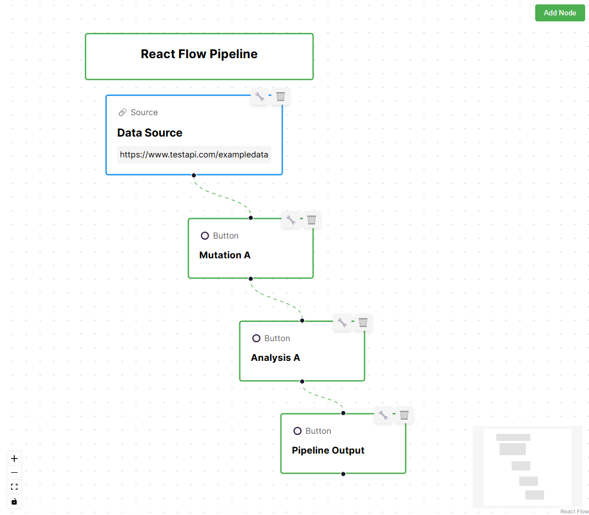
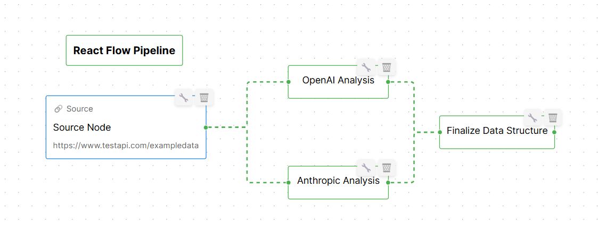
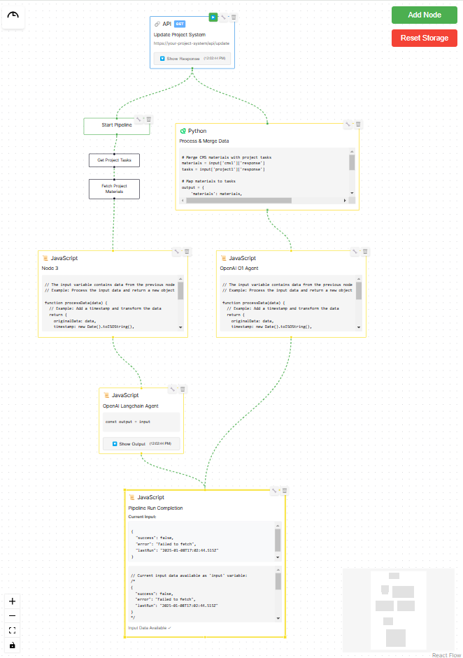
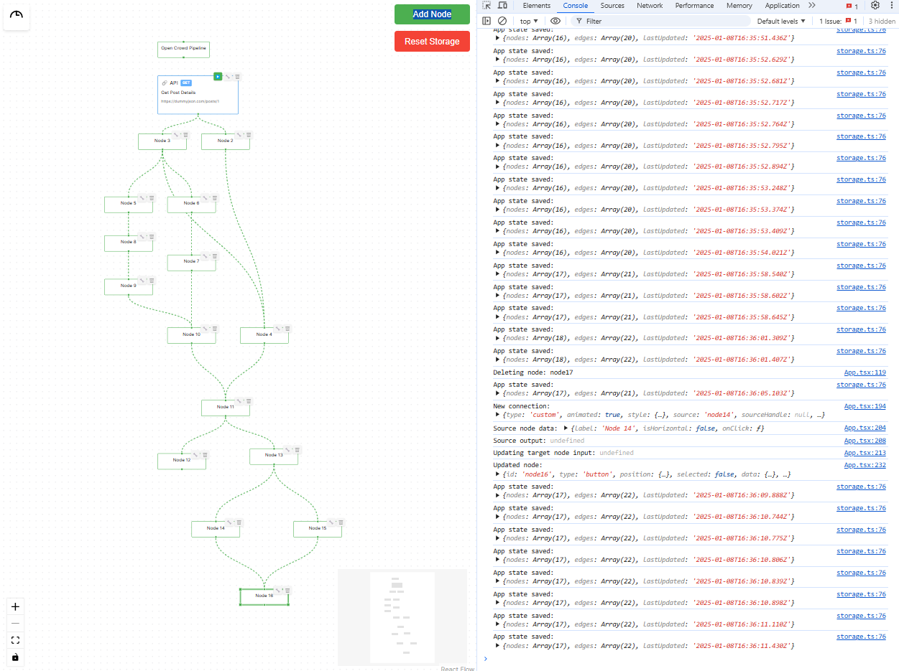
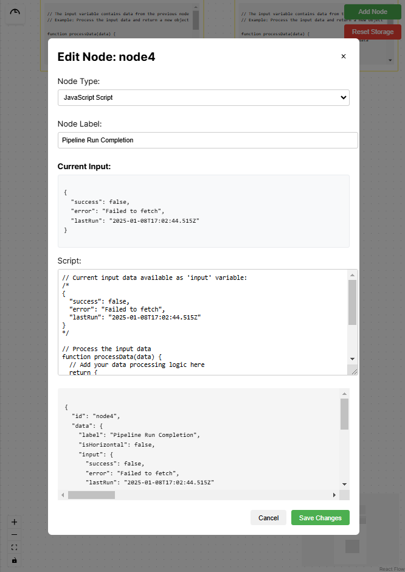

# React Flow Pipeline

A visual pipeline builder using React Flow, allowing users to create, edit, and manage data processing pipelines.

## Features

- Drag and drop interface for pipeline creation
- Multiple node types:
  - Source nodes for data input
  - Button nodes for transformations and actions
- Node editing with custom modals
- Real-time pipeline visualization
- Connection management between nodes
- CRUD operations for all nodes

## Example Pipeline Flow



In this example pipeline:
1. **Data Source**: The entry point that fetches data from an API endpoint
2. **Mutation A**: First transformation step of the data
3. **Analysis A**: Processing and analysis of the transformed data
4. **Pipeline Output**: Final output of the processed data


## Tree Node Anchor Point Rotation (Horizontal & Vertical Trees)



## Advanced Pipeline Flow



An advanced implementation showcasing project sourcing and material management integration.

### Node Types

#### 1. CMS Integration Node 📚
- **Purpose**: Fetches project materials and resources
- **Features**:
  - Connects to headless CMS systems (Strapi, ContentStack, etc.)
  - Configurable content types and filters
  - Authentication handling
  - Real-time content updates

#### 2. Project Management Node 📋
- **Purpose**: Integrates project management data
- **Platforms**:
  - Jira
  - Asana
  - Trello
- **Features**:
  - Custom query support (JQL for Jira)
  - Task and timeline fetching
  - Resource allocation data
  - Status tracking

#### 3. Data Processing Node 🔄
- **Purpose**: Transforms and analyzes data
- **Languages**:
  - Python
  - JavaScript
- **Capabilities**:
  - Data merging
  - Format conversion
  - Analytics processing
  - Custom transformations

#### 4. API Output Node 🔗
- **Purpose**: Sends processed data to external systems
- **Features**:
  - Multiple HTTP methods
  - Custom headers
  - Authentication
  - Error handling

### Pipeline Workflow

1. **Data Collection**
   - CMS Node fetches material data
   - Project Management Node retrieves task information
   - Both nodes run in parallel

2. **Data Processing**
   - Python Node receives data from both sources
   - Performs matching and analysis
   - Generates combined dataset

3. **Output Generation**
   - API Node receives processed data
   - Formats data for target system
   - Sends updates to external service

### State Management

- Automatic state persistence using localStorage
- Real-time updates across nodes
- Error state handling and recovery
- Progress tracking for long operations

## Full Pipeline Flow With Logging & Local Storage



### Advanced Features

1. **Node Controls**
   - Resize handles
   - Rotation controls
   - Custom styling options
   - Drag and drop positioning

2. **Edge Features**
   - Animated connections
   - Custom edge styles
   - Conditional formatting
   - Bidirectional flows

3. **Data Validation**
   - Input validation
   - Type checking
   - Error visualization
   - Schema validation

4. **Pipeline Tools**
   - Export/Import functionality
   - Pipeline templates
   - Version control
   - Undo/Redo support

Each node can be edited, deleted, or connected to other nodes to create a complete data processing pipeline. The system automatically handles data flow and state management between connected nodes.

## Javascript Modal Config



## Tech Stack

- React
- TypeScript
- React Flow (@xyflow/react)
- Vite

## Getting Started

1. Clone the repository
2. Install dependencies:
   ```bash
   npm install
   ```
3. Run the development server:
   ```bash
   npm run dev
   ```

## Usage

1. Click "Add Node" to add new nodes to the pipeline
2. Drag nodes to position them
3. Connect nodes by dragging from one node's output handle to another node's input handle
4. Edit nodes by clicking the edit button (🔧) in the top-right corner
5. Delete nodes using the delete button (🗑️) in the top-right corner
6. Rotate nodes anchor points by clicking the rotate button (🔄) in the top-right corner

## Future Enhancements

- Additional node types for different data operations
- Data preview functionality
- Pipeline validation
- Save/Load pipeline configurations
- Real-time data processing
- Export/Import pipeline definitions

## Resources

Links:
- [React Flow - Docs](https://reactflow.dev)
- [React Flow - Discord](https://discord.com/invite/Bqt6xrs)

Learn:
- [React Flow – Custom Nodes](https://reactflow.dev/learn/customization/custom-nodes)
- [React Flow – Layouting](https://reactflow.dev/learn/layouting/layouting)
